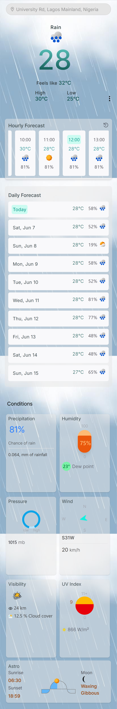
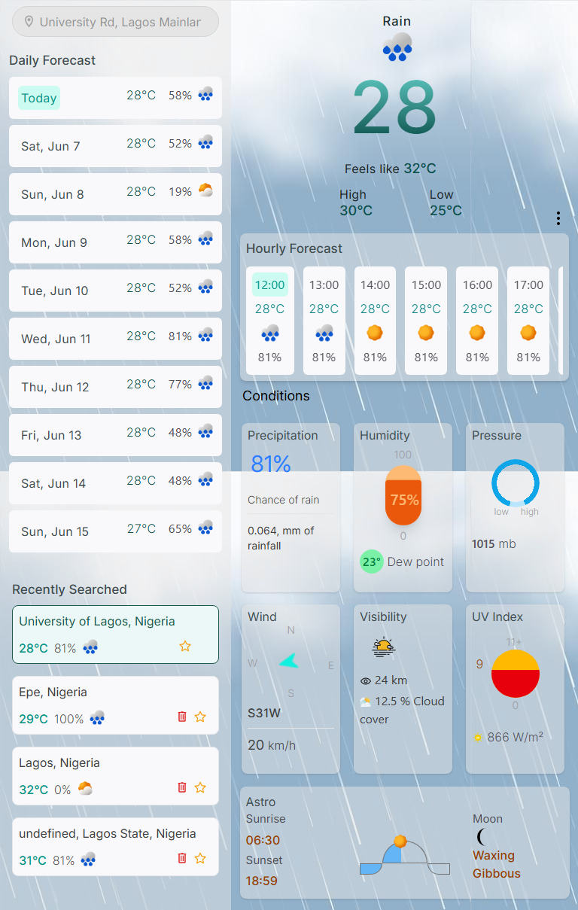

# 🌤️ Utony Weather App

A modern, responsive weather application built with React and Vite that provides real-time weather information for any location worldwide.

## ✨ Features

- **Current Weather Display**: Get up-to-date weather conditions including temperature, humidity, wind speed, and weather descriptions
- **AI-Generated Weather Summary**: Instantly receive an AI-generated summary based on the latest weather data for any location
- **Location Search**: Search for weather data by city name or location
- **Geolocation Support**: Automatically detect user's location for instant weather updates
- **Responsive Design**: Optimized for desktop, tablet, and mobile devices
- **Weather Icons**: Visual weather representations with dynamic icons
- **Temperature Units**: Toggle between Celsius and Fahrenheit
- **Weather Details**: Additional metrics like feels-like temperature, visibility, UV index

## 🚀 Demo

[Live Demo](https://utony-weather-app.vercel.app/)

## 📸 Screenshots




## 🛠️ Built With

- **React** - Frontend framework
- **Vite** - Build tool and development server
- **JavaScript** - Programming language
- **CSS3/TailwindCss** - Styling and animations
- **Weather API** - Data source (Visual Crossing Api)

## 🏁 Getting Started

### Prerequisites

- Node.js (v14 or higher)
- npm or yarn package manager
- Weather API key (from Visual Crossing Api)

### Installation

1. **Clone the repository**
   ```bash
   git clone https://github.com/UtonyDev/utony-weather-app.git
   cd utony-weather-app
   ```

2. **Install dependencies**
   ```bash
   npm install
   # or
   yarn install
   ```

3. **Set up environment variables**
   
   Create a `.env` file in the root directory:
   ```env
   VITE_WEATHER_API_KEY=your_api_key_here
   VITE_API_BASE_URL=https://api.openweathermap.org/data/2.5
   ```

4. **Start the development server**
   ```bash
   npm run dev
   # or
   yarn dev
   ```

5. **Open your browser**
   
   Navigate to `http://localhost:5173` to view the app

## 🔧 Configuration

### API Setup

This app uses [Visual Crossing API] to fetch weather data. To get your API key:

1. Sign up at [[Visual Crossing API](https://www.visualcrossing.com/)]
2. Generate your free API key
3. Add the key to your `.env` file as shown above

### Customization

- **Styling**: Modify CSS files in the `/src/styles` directory
- **Components**: React components are located in `/src/components`
- **API Configuration**: Update API settings in `/src/services/weatherAPI.js`

## 📝 Usage

1. **Search by City**: Enter a city name in the search bar and press Enter
2. **Use Current Location**: Click the location button to get weather for your current position
3. **View Details**: Click on weather cards to see extended information
4. **Switch Units**: Toggle between Celsius and Fahrenheit using the unit switcher

## 🗂️ Project Structure

```
utony-weather-app/
├── public/
│   ├── index.html
│   └── favicon.ico
├── src/
│   ├── components/
│   │   ├── WeatherCard.jsx
│   │   ├── SearchBar.jsx
│   │   ├── LocationButton.jsx
│   │   └── ForecastList.jsx
│   ├── services/
│   │   └── weatherAPI.js
│   ├── styles/
│   │   └── App.css
│   ├── utils/
│   │   └── helpers.js
│   ├── App.jsx
│   └── main.jsx
├── .env.example
├── package.json
├── vite.config.js
└── README.md
```

## 🌐 API Reference

### Weather Data Endpoints

- **Current Weather**: `GET /weather?q={city}&appid={API_KEY}`
- **5-Day Forecast**: `GET /forecast?q={city}&appid={API_KEY}`
- **By Coordinates**: `GET /weather?lat={lat}&lon={lon}&appid={API_KEY}`

### Response Example

```json
{
  "weather": [
    {
      "main": "Clear",
      "description": "clear sky",
      "icon": "01d"
    }
  ],
  "main": {
    "temp": 298.48,
    "feels_like": 298.74,
    "humidity": 64
  },
  "wind": {
    "speed": 0.62
  },
  "name": "Lagos"
}
```

## 🔧 Available Scripts

- `npm run dev` - Start development server
- `npm run build` - Build for production
- `npm run preview` - Preview production build
- `npm run lint` - Run ESLint

## 🚀 Deployment

### Vercel
```bash
npm run build
npx vercel --prod
```

### Netlify
```bash
npm run build
# Upload the dist folder to Netlify
```

### GitHub Pages
```bash
npm install --save-dev gh-pages
npm run build
npm run deploy
```

## 🤝 Contributing

Contributions are welcome! Please feel free to submit a Pull Request.

1. Fork the project
2. Create your feature branch (`git checkout -b feature/AmazingFeature`)
3. Commit your changes (`git commit -m 'Add some AmazingFeature'`)
4. Push to the branch (`git push origin feature/AmazingFeature`)
5. Open a Pull Request

## 📋 TODO

- [ ] Add weather alerts and notifications
- [ ] Implement weather maps integration
- [ ] Add weather history charts
- [ ] Include air quality data
- [ ] Add dark/light theme toggle
- [ ] Implement offline functionality with caching

## 🐛 Known Issues

- Location services may not work on some browsers without HTTPS
- API rate limits may apply for frequent requests
- Dynamic background images reolution issues.

## 📄 License

This project is licensed under the MIT License - see the [LICENSE](LICENSE) file for details.

## 👨‍💻 Author

**UtonyDev**
- GitHub: [@UtonyDev](https://github.com/UtonyDev)
- Email: utonydev@gmail.com

## 🙏 Acknowledgments

- Weather data provided by Visual Crossing
- Icons from Icons8, MaterialUI, & Flaticon.
- Built with React and Vite
- Inspired by modern weather applications

## 📊 Stats


---

⭐ **Star this repository if you found it helpful!**